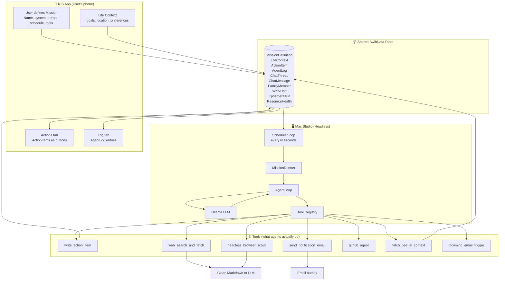

# AgentKVT Data Flow: iOS → Mac Agents → Back to iOS

This document describes how data moves from the moment a user defines a mission in the iOS app through the Mac runner and agents, and back to the iOS app as actions, logs, and chat replies.

## Current architecture notes (2026 direction)

- AgentKVT uses a **shared family Apple ID** for iCloud sync across participating devices.
- Individual people are represented by in-app profiles (`FamilyMember`) inside the shared data model.
- Multi-agent orchestration is **stigmergic**: agents coordinate by reading/writing shared state (`WorkUnit`, `EphemeralPin`, `ResourceHealth`) rather than direct agent-to-agent messaging.
- The Mac execution engine remains serial (`MissionExecutionQueue`) and trigger-driven.

---

## 1. Diagram Overview

---

## 2. Step-by-Step Flow (with examples)

### Step 1: User signs into family iCloud and selects profile

**Where:** Device Settings + iOS app onboarding.

**What happens:**

- Device is signed into iCloud with the shared family Apple ID.
- In app, person creates/selects a `FamilyMember` profile.
- App stores the active profile locally on that device and writes profile-attributed rows to shared SwiftData.

---

### Step 2: User defines a mission in the iOS app

**Where:** iOS app → **Missions** tab → Add / Edit Mission.

**What the user sets:**

| Field | Example |
|-------|--------|
| **Name** | "Find a job" |
| **System prompt** | "You are a career scout. Search for senior iOS roles in SF. For each lead, call write_action_item with systemIntent url.open and payloadJson {\"url\": \"...\", \"label\": \"...\"}." |
| **Schedule** | `weekly|sunday` (runs every Sunday) or `daily|09:00` (every morning) or `webhook` (only when triggered externally) |
| **Allowed tools** | e.g. `write_action_item`, `web_search_and_fetch`, `headless_browser_scout`, `send_notification_email`, `fetch_bee_ai_context` |

**Output contract:** If `write_action_item` is in the mission's allowed tools, the Mac runner now appends runtime guidance telling the model that the tool is authorized and that the mission is not complete until it creates at least one visible action item. The iOS authoring UI explains this generated behavior, so the human-authored prompt can stay focused on the task itself. A mission that still never calls `write_action_item` will run silently on iOS and produce a `"warning"` phase `AgentLog` entry.

**Payload schemas for write_action_item** (see `SystemIntent.payloadFields` in ManagerCore for the canonical definition):

| systemIntent | Required keys | Optional keys |
|---|---|---|
| `calendar.create` | `eventTitle`, `startDate` (ISO-8601) | `durationMinutes`, `notes` |
| `mail.reply` | `toAddress`, `subject`, `draftBody` | — |
| `reminder.add` | `reminderTitle` | `dueDate` (ISO-8601), `notes` |
| `url.open` | `url` (absolute) | `label` |

**Data stored:** A `MissionDefinition` record in SwiftData (same schema on iOS and Mac). Optionally the user also maintains **Life Context** (e.g. key `goals` = "Senior iOS role in SF", key `location` = "PST") used by missions.

**How it reaches the Mac:** The iOS app syncs mission data to the Mac-hosted Rails backend via HTTP. The Mac runner polls the backend for due missions on a 60-second clock tick.

---

### Step 3: Mac runner starts (no UI)

**Where:** Mac Studio — you run `AgentKVTMacRunner` (e.g. via SSH, launchd, or Terminal). No windows; it’s a CLI process.

**What runs:**

- **ModelContainer** is created (SwiftData), pointing at the same store as iOS (or a synced copy).
- **ToolRegistry** is populated with the tools the deployment allows (e.g. `write_action_item`, `send_notification_email`, `fetch_bee_ai_context`, `incoming_email_trigger`, `github_agent` if configured).
- **OllamaClient** is configured (e.g. `OLLAMA_BASE_URL`, `OLLAMA_MODEL`).
- If `RUN_SCHEDULER=1`, the **scheduler loop** runs forever:
  - Every `SCHEDULER_INTERVAL_SECONDS` (default 300):
    - Fetch all `MissionDefinition` from the store.
    - **MissionScheduler.dueMissions(from:)** filters to missions that are **enabled** and **due** at the current time:
      - `daily|08:00` → due when the current time is 08:00.
      - `weekly|sunday` → due when today is Sunday.
      - `webhook` → never due by time (only when something else triggers a run).
    - Optionally, **Dropzone** (`~/.agentkvt/inbound/`) is read; any PDF/CSV/TXT content is passed as **additionalContext** into the mission.
    - **EmailIngestor** watches an inbox directory; when the mission uses `incoming_email_trigger`, the agent can pull the next sanitized email.
  - For each due mission, **MissionRunner.run(mission, additionalContext:)** is called.

---

### Step 4: MissionRunner runs one mission

**What it does:**

1. Builds an **AgentLoop** with the mission’s **allowedMCPTools**.
2. **System prompt** = mission’s `systemPrompt`.
3. **User message** = “Execute your mission. Use the available tools to create action items or other outputs…” — and if there is Dropzone or other inbound content, it’s prepended as “Additional context from inbound files: …”.
4. Calls **AgentLoop.run(systemPrompt:userMessage:)**.
5. When the loop finishes, it writes an **AgentLog** entry with `phase: “outcome”` and the final result (or logs an error and rethrows).
6. If `write_action_item` was an allowed tool but was never called during the run, a `phase: “warning”` log is written: “Mission completed but write_action_item was never called. No action items were created and the user will see no output.” This is visible in the iOS log view.

So the “process” for each mission is: **one LLM conversation**, with the mission’s instructions and optional extra context, during which the model can call tools.

---

### Step 5: AgentLoop — what the agents are actually doing

**Process:**

1. Send to **Ollama**: system message (mission prompt) + user message (execute mission + optional inbound context).
2. Ollama returns either:
   - **No tool calls** → treat the reply as the final outcome; log it and exit.
   - **Tool calls** → for each call, **ToolRegistry.execute(name:arguments:allowedIds:)** is run (only if the tool ID is in the mission’s `allowedMCPTools`), then the tool result is appended as a “tool” message and the conversation continues.
3. Repeat until the model stops requesting tools (or a max round limit).

So the “processes” the agents run are **LLM reasoning + tool executions**. No separate background jobs; one mission = one conversational run with possible multiple tool calls.

**Examples of what “the agent” does in practice:**

| Mission (example) | What the agent does (conceptually) |
|-------------------|-------------------------------------|
| **Find a job** | Reads Life Context (goals, location). Optionally uses `fetch_bee_ai_context` for recent insights. Reasons about next steps. Calls `write_action_item` 2–3 times (e.g. “Apply to Company X”, “Email recruiter Y”, “Update LinkedIn headline”). |
| **Save for down payment** | Maybe uses inbound Dropzone data (e.g. bank CSV). Reasons about savings vs spending. Calls `write_action_item` (“Transfer $500 to savings”, “Review subscriptions”) and/or `send_notification_email` with a weekly summary. |
| **Stay on top of health checkups** | Uses Life Context (e.g. “last physical: 2024-01”). Calls `write_action_item` (“Schedule annual physical”, “Book dentist”). Might call `send_notification_email` to remind. |
| **Reduce anxiety about money** | Could run weekly; uses `fetch_bee_ai_context` if BEE AI has mood/context. Calls `write_action_item` (“Review budget”, “Open 5-min breathing”) and/or `send_notification_email` with a short reassurance summary. |
| **Inbound email triage** | Triggered when new email lands in the Agent Inbox. Agent uses `incoming_email_trigger` to get sanitized content, then `write_action_item` for “Reply to X”, “Add to calendar”, etc. |

---

### Step 6: Tools (what actually runs on the Mac)

| Tool ID | What it does | Writes to store? | Example |
|--------|----------------|------------------|---------|
| **write_action_item** | Creates one **ActionItem** (title, systemIntent, optional payload). | Yes → **ActionItem** | “Review New Job Leads”, intent `url.open` |
| **web_search_and_fetch** | Calls Ollama's web_search and web_fetch APIs; returns clean Markdown (ads/footers/scripts stripped). Requires **OLLAMA_API_KEY**. | No (returns content to LLM) | "iOS roles in Philly" → scraped job pages as Markdown |
| **headless_browser_scout** | Loads a URL in headless WebKit; optional click/fill actions; returns page text. For JS-heavy sites (LinkedIn, banks). | No (returns content to LLM) | Load LinkedIn jobs, click "Next", return listing text |
| **send_notification_email** | Sends an email to the **fixed** user address (from env). Subject/body from LLM. | No (writes to outbox or uses `mail`) | “Weekly job search summary”, body with 3 next steps |
| **fetch_bee_ai_context** | Calls BEE AI API; summarizes transcriptions/insights. | Yes → **AgentLog** (and optionally **LifeContext** key) | Stores under key `bee_ai_recent` for future missions |
| **incoming_email_trigger** | Returns the next pending email from the Agent Inbox (sanitized). | No (consumes from ingestor) | “Intent: Meeting request … General content: …” |
| **github_agent** | (If configured) Performs GitHub operations (e.g. list PRs, create issue). | No (or via other tools) | Used in “PR triage” style missions |
| **fetch_work_units** | Reads stigmergy board work by state/category. | No (returns content to LLM) | Get pending travel work units |
| **update_work_unit** | Updates state/payload/phase on a work unit. | Yes → **WorkUnit** | Mark `in_progress` then `done` |
| **pin_ephemeral_note** | Writes short-lived pin with TTL. | Yes → **EphemeralPin** | “Check weather” expires in 10 min |
| **report_resource_failure** / **list_resource_health** | Tracks cooldown/backoff for failing resources. | Yes → **ResourceHealth** | Back off API for 300 seconds |

So the **only** tool that directly creates things the user sees as “actions to take” in the iOS app is **write_action_item** → **ActionItem**.

---

### Step 7: Back to the iOS app — user sees actions, log, and chat

**Shared store** now contains:

- **ActionItem** rows created by `write_action_item` (title, systemIntent, timestamp, missionId, isHandled, etc.).
- **AgentLog** rows (reasoning, tool calls, outcome) written by MissionRunner and some tools.

**On the phone:**

- **Actions** tab: Lists `ActionItem`s (typically `isHandled == false`). Each row is a tappable “button” (title, systemIntent, relative time). When the user taps, the app can mark it handled and/or perform the intent (e.g. open URL, compose email).
- **Log** tab: Lists **AgentLog** entries (phase, mission name, content, timestamp) so the user can see what the agent did.
- **Chat** tab: Shows `ChatThread` / `ChatMessage` conversations. User messages are queued in shared state, and the Mac runner processes pending messages and writes assistant replies.

So the “data flow back” is: **Mac agents call tools and process queued chat messages → ActionItem / AgentLog / ChatMessage rows are written into shared SwiftData → iOS app reads that store and shows Actions + Log + Chat.**

---

## 3. End-to-end example: “Find a job” mission

1. **iOS:** User creates mission “Find a job”, prompt as above, schedule `weekly|sunday`, tools `write_action_item`, `fetch_bee_ai_context`. Life Context: `goals` = "Senior iOS, SF", `location` = "PST".
2. **Store:** MissionDefinition and LifeContext are saved (and synced to Mac if using CloudKit/shared store).
3. **Mac:** Next Sunday at 00:00 (or when the scheduler’s minute matches), scheduler sees “Find a job” as due, calls `MissionRunner.run(mission)`.
4. **MissionRunner:** Starts AgentLoop with mission’s prompt and tools.
5. **AgentLoop:** Sends prompt + “Execute your mission…” to Ollama. Model may call `fetch_bee_ai_context` to get recent insights, then reason, then call `write_action_item` three times: e.g. “Apply to Acme Corp”, “Email Sarah (recruiter)”, “Update resume for backend focus”.
6. **write_action_item:** Inserts three **ActionItem** rows into the shared store; AgentLog entries are written for tool calls and outcome.
7. **iOS:** User opens the app; **Actions** tab shows the three new items. User taps “Apply to Acme Corp” → app can open the job link or mark done; **Log** tab shows what the agent did.

That’s the full loop: **family profile + mission on iOS → Mac runs it with tool constraints over shared board state → tools write ActionItems/logs/state updates → user sees and acts on them on iOS.**
