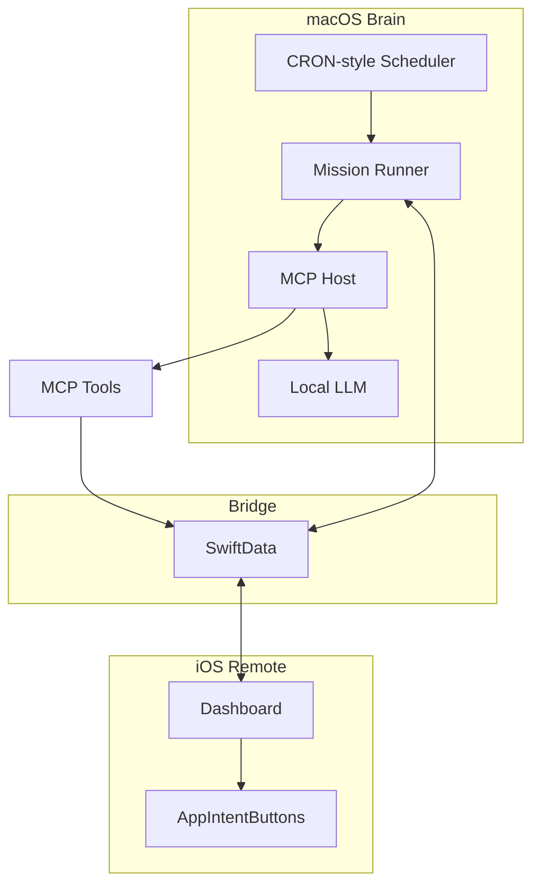
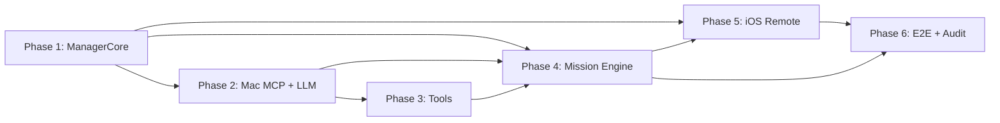

# SuperAgent Implementation Plan (Phased)

Based on [FOUNDATIONAL_PLAN.MD](../FOUNDATIONAL_PLAN.MD) and [README.md](../README.md). The codebase (AgentKVT) has implemented most phases; this plan reflects the current integrations and naming.

---

## Architecture Summary

- **Brain (macOS):** Headless MCP host + autonomous mission runner; inference via Ollama/LM Studio.
- **Remote (iOS):** SwiftUI remote with dashboard + dedicated chat + family profile onboarding/selection.
- **Bridge:** Shared state via SwiftData (local network/Tailscale or CloudKit); Mac writes, iOS observes.

---

## Phase 1: Shared schema and package (ManagerCore)

**Goal:** Single source of truth for persistence and sync. No app UIs yet.

**Deliverables:**

- **Swift Package `ManagerCore`** (new repo or subfolder) containing:
  - **LifeContext** — static facts / user preferences (goals, locations, dates).
  - **MissionDefinition** — `missionName`, `systemPrompt`, `triggerSchedule`, `allowedMCPTools` (tool ID array).
  - **ActionItem** — `title`, `systemIntent`, `payloadData`, `relevanceScore`, `timestamp` (drives iOS buttons).
  - **AgentLog** — append-only log of agent reasoning, tool calls, outcomes (audit).
  - **FamilyMember** — in-app identity rows for family attribution on shared devices/account.
  - **WorkUnit / EphemeralPin / ResourceHealth** — stigmergy board models for state-driven coordination, TTL decay, and negative routing signals.
- SwiftData model definitions and, if needed, lightweight migration strategy.
- **Sync decision:** CloudKit vs local network (e.g. Tailscale) and minimal config so both apps can attach to the same store. *Current status:* Deferred; initial implementation uses **local-only SwiftData** (no sync). See [SYNC.md](SYNC.md).

**Dependencies:** None.  
**Exit criteria:** Package builds; schema is documented; sync path chosen and documented.

---

## Phase 2: macOS Brain — MCP host and LLM integration

**Goal:** Mac app that hosts MCP and talks to a local LLM; no missions yet.

**Deliverables:**

- **macOS app target** (background/headless capable):
  - Lifecycle so it can run as a background service (e.g. menu-bar or LaunchAgent).
- **MCP Server layer (Swift):**
  - Implement MCP host that accepts tool definitions and executes tool calls.
  - **Zero-trust boundary:** All tool implementations validate and sanitize LLM-provided arguments; no blind execution.
- **LLM integration:**
  - Connect to local host (Ollama or LM Studio): send prompts, receive responses, parse tool-call requests and feed results back.
  - No mission scheduling yet — e.g. single "test" prompt that can call one tool and write one `ActionItem` to SwiftData.
- **Dedicated-machine runtime guidance (docs/scripts):**
  - Document the intended deployment model: dedicated Mac, one mission at a time, bounded queueing, and LLM-host tuning instead of an in-app CPU/GPU throttle.

**Dependencies:** Phase 1 (ManagerCore + schema).  
**Exit criteria:** Mac app runs; one test prompt triggers one tool call and one `ActionItem` write; dedicated-machine runtime guidance documented.

---

## Phase 3: Sandboxed MCP tools

**Goal:** Safe, minimal tools the agent can use; principle of least privilege.

**Deliverables:**

- **write_action_item** (implemented):
  - Writes one `ActionItem` to SwiftData (title, systemIntent, optional payload). Primary way the agent surfaces actions to the iOS dashboard.
- **send_notification_email** (implemented):
  - Swift MCP tool; destination email fixed (env/keychain); only `subject` and `body` from LLM. No way for the agent to specify recipient.
- **github_agent** (implemented):
  - Auth via dedicated Bot PAT; configuration that restricts the token to designated agent-only repos (e.g. list issues). See [TOOL_IDS.md](TOOL_IDS.md).
- **fetch_bee_ai_context** (implemented):
  - Fetches transcriptions/insights from BEE AI wristband API; stores summaries in LifeContext or AgentLog. Env: `BEE_AI_BASE_URL`, `BEE_AI_API_KEY`.
- **incoming_email_trigger** (implemented):
  - Returns next pending email from Agent Inbox (intent + sanitized content; PII stripped). Requires EmailIngestor; inbox dir `~/.agentkvt/inbox` or `AGENTKVT_INBOX_DIR`. See [EMAIL_INGESTOR.md](EMAIL_INGESTOR.md).
- **web_search_and_fetch** (implemented):
  - Uses Ollama's web_search and web_fetch APIs; returns clean Markdown to the LLM. Requires `OLLAMA_API_KEY`.
- **headless_browser_scout** (implemented):
  - Loads a URL in headless WebKit; optional click/fill actions; returns page text. For JS-heavy sites (e.g. job boards, banks).
- **Tool registry and allowlist:**
  - Each tool has a stable ID; mission runner (Phase 4) only invokes tools whose IDs are in the mission's `allowedMCPTools`. See [TOOL_IDS.md](TOOL_IDS.md).

**Dependencies:** Phase 2 (MCP host + LLM integration).  
**Exit criteria:** All tools callable via MCP; allowlist enforced; no recipient override for email; GitHub scoped to bot repos.

---

## Phase 4: Dynamic mission engine (Mac)

**Goal:** User-defined missions run on a schedule; output always normalized to `ActionItem` (+ optional `AgentLog`).

**Deliverables:**

- **Mission runner:**
  - Observe/read `MissionDefinition` from SwiftData.
  - When a mission is due (by `triggerSchedule`): load `systemPrompt` and `allowedMCPTools`, invoke LLM with only those tools, run loop (reasoning + tool calls), then write results to `ActionItem` (and optionally `AgentLog`).
- **Inbound context (implemented):**
  - **Dropzone** (`~/.agentkvt/inbound/` or `AGENTKVT_INBOUND_DIR`): PDF/CSV/TXT content is read and passed as `additionalContext` into the mission. See [DROPZONE.md](DROPZONE.md).
  - **EmailIngestor:** When a mission uses `incoming_email_trigger`, the agent can pull the next sanitized email from the inbox.
- **CRON-style scheduler:**
  - Evaluate `triggerSchedule` (e.g. daily 8 AM, weekly, or webhook-triggered if chosen); trigger runner for due missions.
- **Standardized output contract:**
  - Regardless of mission type, runner always produces `ActionItem`(s) (e.g. "Review New Job Leads", "Approve Generated Document") with consistent fields; iOS only renders these.
- **No hardcoded missions:** Test missions (e.g. Career scout, Finance monitor) are created via data/UI, not compiled into the binary.

**Dependencies:** Phase 1 (MissionDefinition, ActionItem, AgentLog), Phase 2 (runner–LLM–MCP loop), Phase 3 (tools + allowlist).  
**Exit criteria:** At least one mission definition (from UI or seed data) runs on schedule and produces `ActionItem`(s) and optional log entries.

---

## Phase 5: iOS Remote — dashboard, chat, identity, and mission authoring

**Goal:** User sees agent output, can use chat for conversational follow-up, and can define/edit missions.

**Deliverables:**

- **SwiftUI app** with SwiftData model container using ManagerCore schema (and same sync as Mac).
- **Family profile onboarding/selection:**
  - Device uses the shared family Apple ID for iCloud sync.
  - In-app users create/select `FamilyMember` profiles.
  - Active profile on each device is stored locally; profile rows sync through CloudKit.
- **Dashboard:**
  - Observe `ActionItem`; render dynamic **AppIntentButtons** (title, intent, payload).
  - Show attributed content (for example uploader/sender profile where available).
- **Dedicated chat interface:**
  - `ChatThread`/`ChatMessage` with profile attribution for user messages.
- **Mission authoring UI:**
  - Create/edit `MissionDefinition`: mission name, system prompt, trigger schedule, allowed MCP tools (multi-select from registered tool IDs).
- **LifeContext UI (optional but recommended):**
  - Edit static facts/preferences so the agent can use them in prompts (e.g. goals, location, important dates).

**Dependencies:** Phase 1 (ManagerCore + sync), Phase 4 (missions produce ActionItems).  
**Exit criteria:** Dashboard shows ActionItems from Mac; user can add/edit missions and have them run on the Brain; optional LifeContext editing works.

---

## Phase 6: End-to-end verification and audit

**Goal:** Validate full loop and compliance with the plan (no hardcoded missions; audit trail).

**Deliverables:**

- **E2E test scenarios (manual or automated):** See [E2E_VERIFICATION.md](E2E_VERIFICATION.md).
  - **Career (Tech Job Scout):** Mission that scans for roles and creates ActionItems (e.g. `write_action_item`, optional `web_search_and_fetch` / `headless_browser_scout`).
  - **Finance (Budget Sentinel):** Mission that monitors CSV/transaction data (e.g. via Dropzone) and produces ActionItems when limits exceeded.
- **AgentLog:** Ensure all missions write reasoning/tool-calls/outcomes to `AgentLog`; verify one audit path (e.g. simple log viewer or export).
- **Sync and stability:** Confirm SwiftData sync between Mac and iOS; no hardcoded missions in binary; dedicated-machine runtime guidance matches actual runner behavior.

**Dependencies:** All previous phases.  
**Exit criteria:** Both example missions run from user-defined definitions; ActionItems appear on iOS; AgentLog is populated and reviewable; sync and runtime guidance documented/verified.

---

## Suggested repo layout (reference)

*Actual layout in this repo (AgentKVT):*

- `ManagerCore/` — Swift package (SwiftData models + optional sync helpers).
- `AgentKVTMac/` — macOS app (MCP host, mission runner, scheduler, tool implementations). Runner: `AgentKVTMacRunner`; one-off test or `RUN_SCHEDULER=1` for CRON-style runs.
- `AgentKVTiOS/` — iOS app (SwiftUI dashboard, profile onboarding/selection, dedicated chat, mission/LifeContext UI).
- `Docs/` — SYNC.md, LLM_THROTTLING.md, TOOL_IDS.md, DATA_FLOW.md, E2E_VERIFICATION.md, DROPZONE.md, EMAIL_INGESTOR.md.

---

## Out of scope (per README)

- DIYProjectManager retooling is out of scope; this plan does not assume it. Patterns from it may be reused later without committing to that codebase.

---

## Phase dependency diagram

